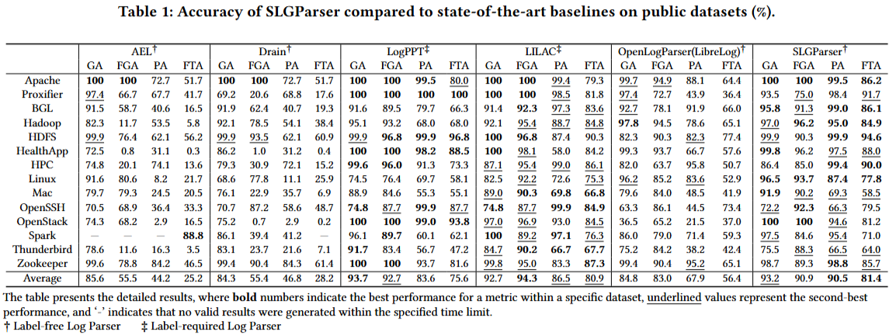
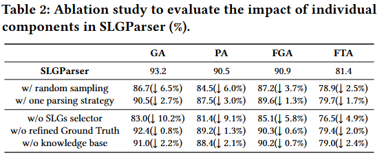
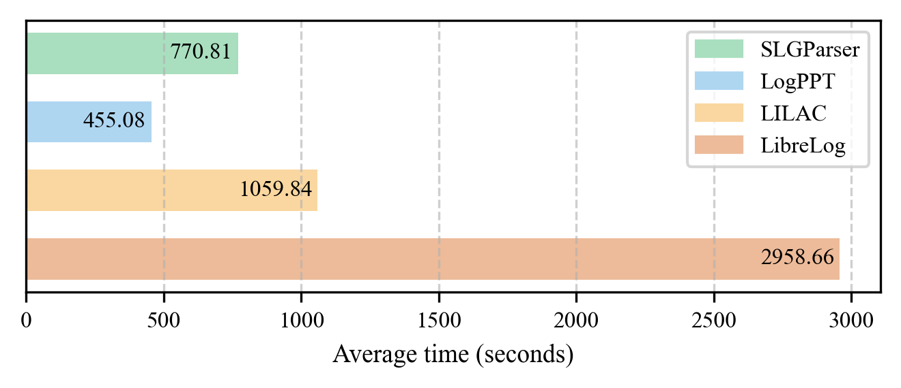
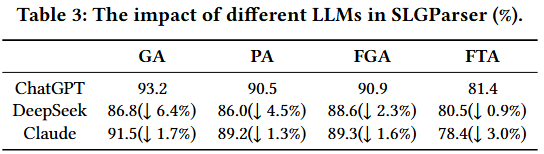
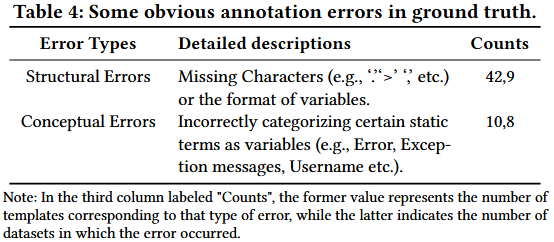

# SLGParser

## Repository Structure

```bash
.
├── README.md
├── evaluation
│   ├── figures
│   │   ├── ablation_study.png
│   │   ├── accuracy.png
│   │   ├── different_LLMs.png
│   │   ├── efficiency.png
│   │   └── refined_ground_truth.png
│   └── results	#results of SLGParser and baselins
├── full_dataset	#LogHub-2.0 dataset
├── sampled_examples_pure	#run LogSampler.py to construct candidate set
├── vocab	#knowledge base
├── api_config.json	#set the key and url of models
├── requirements.txt
.
.	# Codes
.
└── utils.py
```

## Requirement

```bash
python >= 3.9
openai
pandas
```

## Datasets

​	download the full datasets of loghub-2.0 via [Zenodo](https://zenodo.org/record/8275861) and unzip these datasets into the directory of `full_dataset`.

## Run

1. Construct Candidate sets

​	run the program to construct candidate sets and which is placed in the sampled_examples_pure directory.

```bash
python LogSampler.py
```


2. Refine the Ground Truth

​	Run the program to refine errors in Ground Truth.

```bash
python correct_template.py
```


3. Online log parsing

- Add an LLM API (sk-xxxxxxxx) to the `api_config.json` file
- run the program to parse logs.You can run the program in the following ways.

```bash
./online_parsing.sh
```

or

```bash
python SLGParser.py --model gpt-4o-2024-08-06 --candidate hierarchical --similarity enhanced --sample 3
```

you can also run `python SLGParser.py` to use the default experimental settings.

## Experimental results

The experimental results are stored in the `evaluation/results` directory.

<p align="center"></p>
<p align="center"></p>
<p align="center"></p>
<p align="center"></p>
<p align="center"></p>
